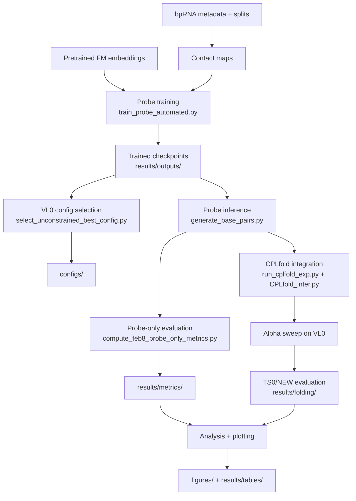

# Interpreting RNA Foundation Models via Structural Probing

**Jaehyuk Choi** — BSc Artificial Intelligence, University of Edinburgh (4th Year Project)

## Overview

This repository investigates whether pretrained RNA foundation models encode base-pairing structure in their learned representations. We train low-rank bilinear probes on frozen per-residue embeddings from five encoder-only RNA language models and a one-hot baseline, then evaluate whether the recovered contact information can improve thermodynamic structure prediction when injected as soft priors into CPLfold.

**Models tested:** ERNIE-RNA, RNA-FM, RoBERTa, RiNALMo, RNABERT, one-hot baseline
**Dataset:** bpRNA (TR0 / VL0 / TS0 / NEW splits)
**Key finding:** All five pretrained models recover significant base-pairing signal; ERNIE-RNA benefits most from CPLfold integration, while RoBERTa transfers best to unseen RNA families.

## Repository Structure

```
├── code/
│   ├── models/              Bilinear probe definition (StructuralContactProbe)
│   ├── probe_training/      Training pipeline + Slurm scripts
│   ├── probe_inference/     Generate base-pair scores from trained probes
│   ├── evaluation/          Metric computation, config selection, summary tables
│   ├── folding_integration/ CPLfold engine + alpha-sweep experiments
│   ├── analysis/            Canonical rates, statistical tests, pair statistics
│   ├── plotting/            All dissertation figure scripts
│   ├── preprocessing/       Contact map generation, dataset statistics
│   ├── utils/               Shared evaluation helpers
│   └── run_sh/              Shell launchers
├── configs/                 Validation-selected hyperparameter configs
├── data/                    bpRNA metadata and split assignments
├── results/                 All computed metrics, sweeps, tables, statistics
├── figures/                 Generated dissertation figures (main + appendix)
├── dissertation/            LaTeX source (skeleton.tex)
└── requirements.txt         Python dependencies
```

## Pipeline



## Task-to-Code Mapping

| Task | Code | Key inputs | Key outputs |
|------|------|-----------|-------------|
| **Probe model** | `code/models/bilinear_probe_model.py` | — | `BilinearContactProbe` class |
| **Training** | `code/probe_training/train_probe_automated.py` | Embeddings, contact maps | `results/outputs/{model}/layer_*/k_*/seed_*/best.pt` |
| **Slurm training** | `code/probe_training/sbatch_train_model.sh` | Model name | All (layer, k) checkpoints for one model |
| **Full pipeline** | `code/probe_training/run_all_experiments.sh` | — | All training + downstream jobs |
| **Config selection** | `code/evaluation/select_unconstrained_best_config.py` | `results/outputs/` | `configs/final_selected_config_unconstrained.csv` |
| **TS0/NEW metrics** | `code/evaluation/compute_feb8_probe_only_metrics.py` | Configs, checkpoints | `results/metrics/final_{test,new}_metrics.csv` |
| **Wobble metrics** | `code/evaluation/compute_probe_only_with_wobble.py` | Configs, checkpoints | `results/metrics/*_wobble.csv` |
| **Summary table** | `code/evaluation/build_summary_table.py` | Final metrics | `results/metrics/unconstrained_results_summary.csv` |
| **CPLfold engine** | `code/folding_integration/CPLfold_inter.py` | Sequence, energy params, bonus matrix | Dot-bracket structure |
| **CPLfold experiments** | `code/folding_integration/run_cplfold_exp.py` | Base pairs, configs | `results/folding/detailed_alpha_sweep_*.csv` |
| **VL0 alpha sweep** | `code/probe_training/run_split_pipeline.py` | VL0 sequences, probe scores | `results/sweeps/vl0_alpha_sweep_both.csv` |
| **Canonical rates** | `code/analysis/build_canonical_rate_table_with_baseline.py` | Wobble metrics, baseline | `results/tables/canonical_rate_table_with_baseline.csv` |
| **RoBERTa stats** | `code/analysis/roberta_vs_others_statistical_test.py` | Per-sequence metrics | `results/statistics/roberta_vs_others_significance.csv` |
| **Pair statistics** | `code/analysis/compute_pair_statistics.py` | bpRNA metadata, splits | `results/tables/pair_statistics_by_split.csv` |
| **Figures** | `code/plotting/plot_*.py` | Various results CSVs | `figures/main/*.png`, `figures/appendix/*.png` |

## Dissertation Results Mapping

| Dissertation reference | Result file |
|----------------------|-------------|
| Table 5 — Probe-only F1 (unconstrained) | `results/metrics/unconstrained_results_summary.csv` |
| Table 6 — Canonical pairing rates | `results/tables/canonical_rate_table_with_baseline.csv` |
| Table 7 — Pair type distributions | `results/tables/{onehot,rinalmo}_pair_combo_distribution.csv` |
| Table 8 — Selected hyperparameters | `configs/final_selected_config_unconstrained.csv` |
| Table 9 — Probe-only F1 (best config) | `results/metrics/final_{test,new}_metrics.csv` |
| Table 11 — Unconstrained vs best comparison | `results/metrics/probe_unconstrained_vs_best_comparison.csv` |
| Table 12 — F1 by sequence length | `results/per_sequence/{ts,new}_per_sequence_metrics.csv` |
| Table 13 — RoBERTa significance tests | `results/statistics/roberta_vs_others_significance.csv` |
| Fig — α sweep (VL0) | `results/sweeps/vl0_alpha_sweep_both.csv` |
| Fig — α=0 vs best α | `results/folding/alpha0_vs_best_full.csv` |
| Fig — Layer-wise F1 | `results/sweeps/layer_wise_val_f1.csv` |
| Fig — k comparison | `results/sweeps/k_comparison_val_f1.csv` |
| CPLfold optimal α | `configs/val_optimal_results.csv` |

## Reproduction

### Prerequisites

- Python 3.10+, PyTorch 1.13+ (CUDA recommended)
- `pip install -r requirements.txt`
- Optional: ViennaRNA Python bindings (`conda install -c bioconda viennarna`)

### External data (not included — too large)

| Artefact | Expected location |
|----------|------------------|
| Per-layer embeddings | `data/embeddings/{MODEL}/bpRNA/by_layer/layer_{N}/{id}.npy` |
| Contact maps | `data/contact_maps/bpRNA/{id}_contact.npy` |
| Trained checkpoints | `results/outputs/{model}/layer_*/k_*/seed_*/best.pt` |

Contact maps can be regenerated: `python code/preprocessing/compute_structure_features.py`

### Train a single probe

```bash
python code/probe_training/train_probe_automated.py \
    --model rnafm --layer 11 --k 64 --seed 42
```

### Run full Slurm pipeline (all models)

```bash
bash code/probe_training/run_all_experiments.sh
```

### Compute probe-only metrics

```bash
bash code/run_sh/run_probe_only.sh
```

### Generate figures

```bash
bash code/run_sh/run_all_plots.sh
```

## Experimental Parameters

| Parameter | Values |
|-----------|--------|
| Models | ERNIE-RNA, RNA-FM, RoBERTa, RiNALMo, RNABERT, one-hot |
| Projection rank (k) | 32, 64, 128 |
| Decoding modes | unconstrained, canonical-only, canonical+wobble |
| Threshold (τ) | Swept 0.50–0.95 on VL0 |
| CPLfold α | Swept 0.0–2.0 (step 0.02) on VL0 |
| Folding backends | ViennaRNA, CONTRAfold |
| Splits | TR0 (train), VL0 (val), TS0 (in-distribution test), NEW (OOD test) |

## License

This repository is submitted as part of a BSc dissertation at the University of Edinburgh.
